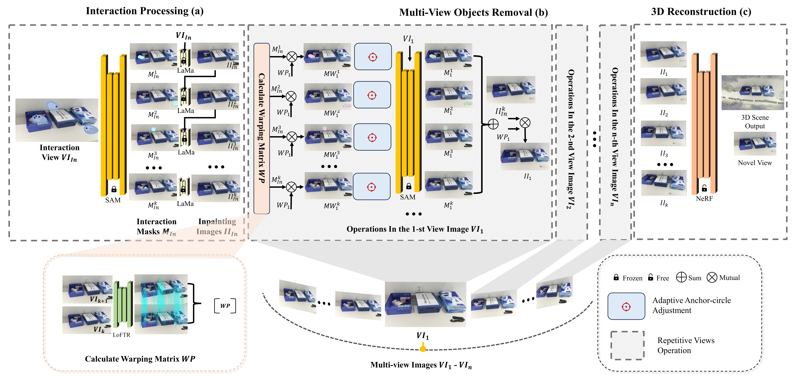
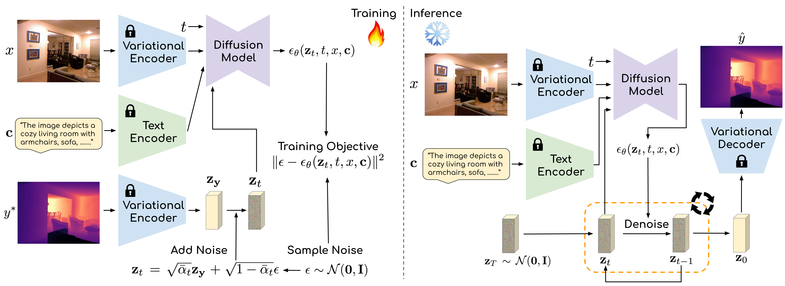
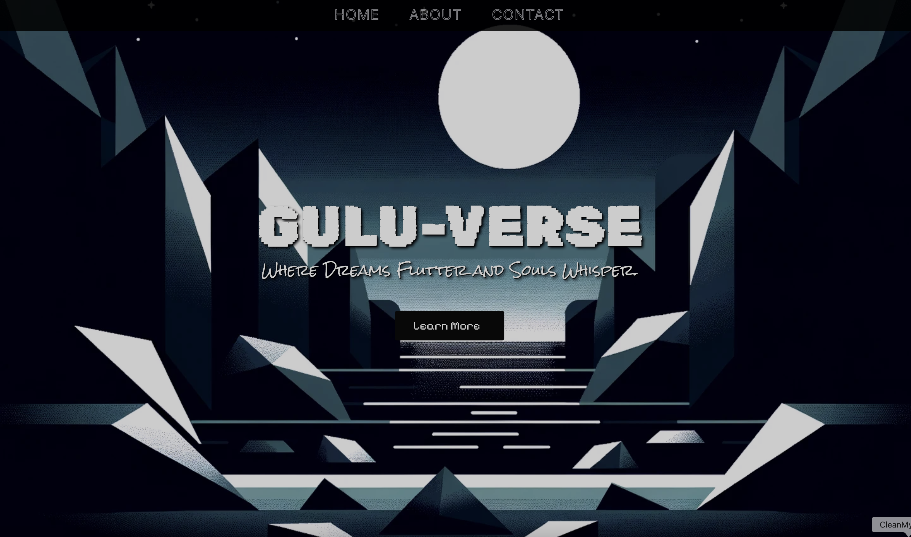
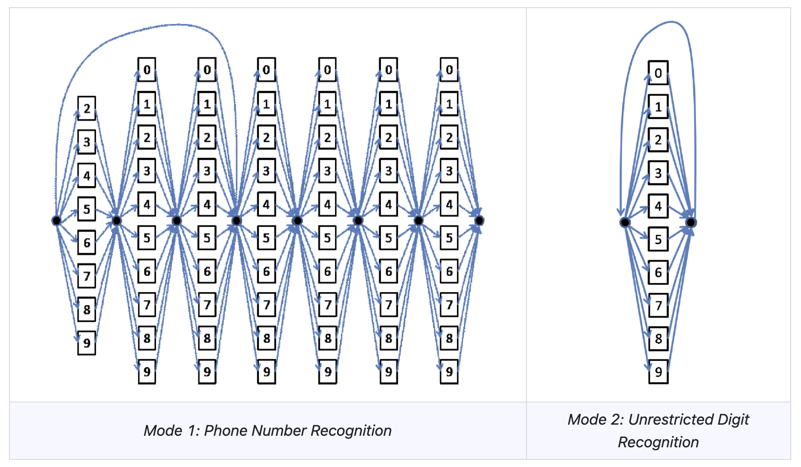








I am a Master’s student in Computer Science at Brown University. 

Previously, I completed my undergraduate studies with distinction in Computer Science at Duke Kunshan University and Duke University (2021–2025), where I had the privilege of being advised by [Prof. Kaizhu Huang](https://sites.google.com/view/kaizhu-huang-homepage). 

In the summer of 2024, I spent an enriching time at [Yale Vision Lab](https://vision.cs.yale.edu/) under the guidance of [Prof. Alex Wong](https://vision.cs.yale.edu/members/alex-wong.html).

During the fall 2023 term, I had a wonderful experience at Duke University, where I worked as a research assistant [Duke University I3T Lab](https://maria.gorlatova.com/), under the supervision of [Prof. Maria Gorlatova](https://maria.gorlatova.com/bio/).

***Research Interests***: I aim to investigate 3D reconstruction, perception, and generation, with an interest in leveraging multimodal inputs to assist in vision tasks. I am also passionate about designing efficient visual systems that can enable embodied agents to better understand and interact with the physical world while addressing real-world challenges.

# 🔥 News
- *2025.05*: &nbsp;🎉🎉 Join Sony R&D Center China in Beijing as a 3D Vision research intern!
- *2025.05*: &nbsp;🎉🎉 Graduation from Duke Kunshan University/Duke University with Distinction! Grateful to everyone who has been by my side throughout the journey!
- *2024.05*: &nbsp;🎉🎉 Visiting student at [Yale Vision Lab](https://vision.cs.yale.edu/), advised by [Prof. Alex Wong](https://vision.cs.yale.edu/members/alex-wong.html).
- *2023.09*: &nbsp;🎉🎉 Research assistant at [Duke University I3T Lab](https://maria.gorlatova.com/), advised by [Prof. Maria Gorlatova](https://maria.gorlatova.com/bio/).
- *2021.08*: &nbsp;🎉🎉 Join Duke Kunshan University as an undergraduate with scholarship for outstanding student.

# 📝 Publications 

Under Review

[HOMER: Homography-Based Efficient Multi-view 3D Object Removal](https://arxiv.org/abs/2501.17636) 

***Jingcheng Ni**, Weiguang Zhao, Daniel Wang, Ziyao Zeng, Chenyu You, Alex Wong, Kaizhu Huang*

Under Review

[PriorDiffusion: Leverage Language Prior in Diffusion Models
for Monocular Depth Estimation.](http://arxiv.org/abs/2411.16750) 

*Ziyao Zeng, **Jingcheng Ni**, Daniel Wang, Patrick Rim, Younjoon Chung, Fengyu Yang, Byung-Woo Hong, Alex Wong* 

# ✨ Interesting Projects

[Gulu-Verse](https://guluverse.com/) is a recommendation website designed to bring some meaning to life and make your life easier. This platform offers personalized suggestions (like films) based on user preferences and interactions.

[Code](https://github.com/Somnambulist0/GuLu-Verse)

[Speech Recognition (Manual Implementation)](https://github.com/Somnambulist0/Speech-Recognition-Manual-Implementation)

CS304 Speech Recognition Course Project

# 📖 Educations
- *2025.08 - 2027.05(expected)*, MS in Computer Science, Brown University
- *2021.08 - 2025.05*, BS in Computer Science, Duke University. 
- *2021.08 - 2025.05*, BS in Computer Science, Duke Kunshan University.
- *2024.05 - 2024.08*, Visiting Student, Yale University.

